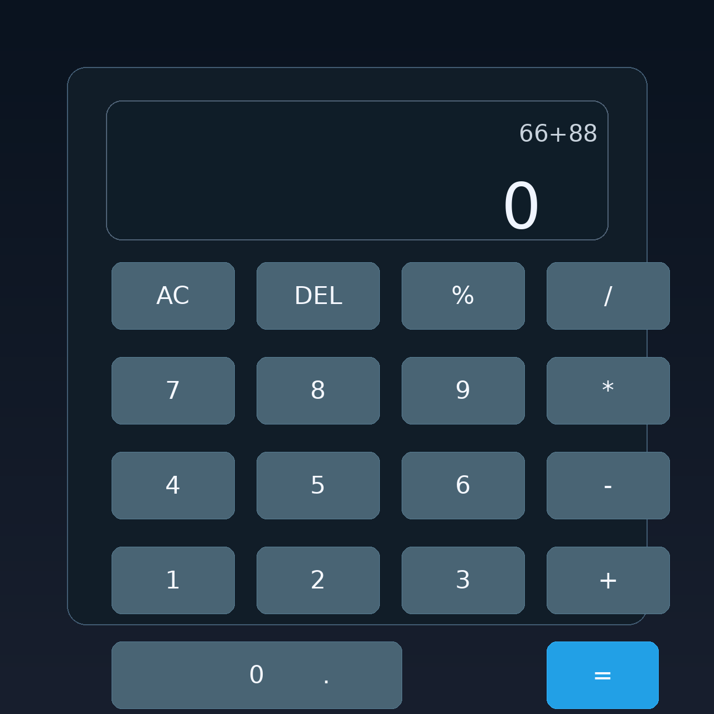

# My first vibe coding app

<div align="center">
  
  
  
  
</div>

<p align="center">
  <strong>A sleek calculator web app built with FastAPI and a modern static frontend.</strong>
</p>

<p align="center">
  
</p>

## Overview

This project is a simple but polished calculator app created as a first vibe coding project. It demonstrates how to combine:

- a Python backend with FastAPI
- a modern static HTML/CSS/JS frontend
- a JSON API for arithmetic evaluation
- a minimal full-stack demo that runs locally in seconds

## Features

- Modern calculator interface
- Support for basic arithmetic operations
- Safe expression evaluation through the backend
- JSON response format from `/api/calc`
- Easy setup for local development
- Beginner-friendly full-stack example

## Tech Stack

- Python 3.14
- FastAPI
- Uvicorn
- Static HTML/CSS/JavaScript

## Installation

### Quick start

```bash
cd /home/terry/projects/project-01
python3 -m venv .venv
source .venv/bin/activate
python -m pip install --upgrade pip
python -m pip install -r requirements.txt
./run.sh
```

### Alternative manual start

```bash
cd /home/terry/projects/project-01
source .venv/bin/activate
python -m uvicorn calculator:app --host 0.0.0.0 --port 8000
```

Open the app at:

```text
http://localhost:8000/
```

## Project Structure

```text
project-01/
├── calculator.py          # FastAPI app entry point
├── static/
│   └── index.html         # Calculator frontend UI
├── requirements.txt       # Python dependencies
├── .env.example           # Example environment file
├── .gitignore             # Git ignore rules
├── README.md              # Project documentation
├── .venv/                 # Local virtual environment
├── .vscode/               # VS Code workspace settings
└── __pycache__/           # Python cache files
```

## API Usage

### Endpoint

```text
POST /api/calc
```

### Example request

```bash
curl -X POST http://127.0.0.1:8000/api/calc \
  -H "Content-Type: application/json" \
  -d '{"expression":"2+3*4"}'
```

### Example response

```json
{
  "expression": "2+3*4",
  "result": 14
}
```

## Example Calculations

```text
2 + 3 * 4 = 14
10 / 2 = 5
5 % 2 = 1
2 ^ 3 = 8
```

## Screenshot


This release includes the final calculator interface with:

- a large result display area
- a dark modern theme
- numeric keypad and operator buttons
- clear and delete actions
- a blue equals action for key emphasis

## Notes

This project is intentionally compact and beginner-friendly. It is ideal for learning:

- FastAPI routing and request handling
- static frontend integration
- simple input validation
- API-based UI interactions

## Release Notes

### v1.1.0

- Updated project metadata and polishing for GitHub release readiness
- Added a real app screenshot asset in the docs folder
- Improved README presentation for a cleaner project landing page
- Kept the calculator app, API, and local startup workflow intact

### v1.0.0

- Initial release of the calculator app
- Added FastAPI backend and JSON calculator endpoint
- Added modern calculator UI in the static frontend
- Added local development script and CI workflow
- Added project documentation and templates

## License

This project is provided for learning and demo purposes.

## Future Improvements

- add parentheses support
- add a history panel
- add scientific calculator functions
- improve styling and responsiveness
- add tests for the calculator API

## How to Publish to GitHub

1. Initialize a Git repository if you have not already done so:

```bash
git init
git add .
git commit -m "Initial release: calculator app"
```

2. Create a new repository on GitHub.

3. Link the local repository to GitHub:

```bash
git branch -M main
git remote add origin <your-github-repo-url>
git push -u origin main
```

4. Add a descriptive repository name and description in the GitHub UI.

5. Optionally add a topic list such as:

```text
python fastapi calculator webapp demo
```

6. Enable GitHub Pages or release notes if needed for project visibility.

7. Tag the first release:

```bash
git tag -a v1.0.0 -m "Release v1.0.0"
git push origin v1.0.0
```

This makes the project ready to be shared publicly and versioned cleanly.
